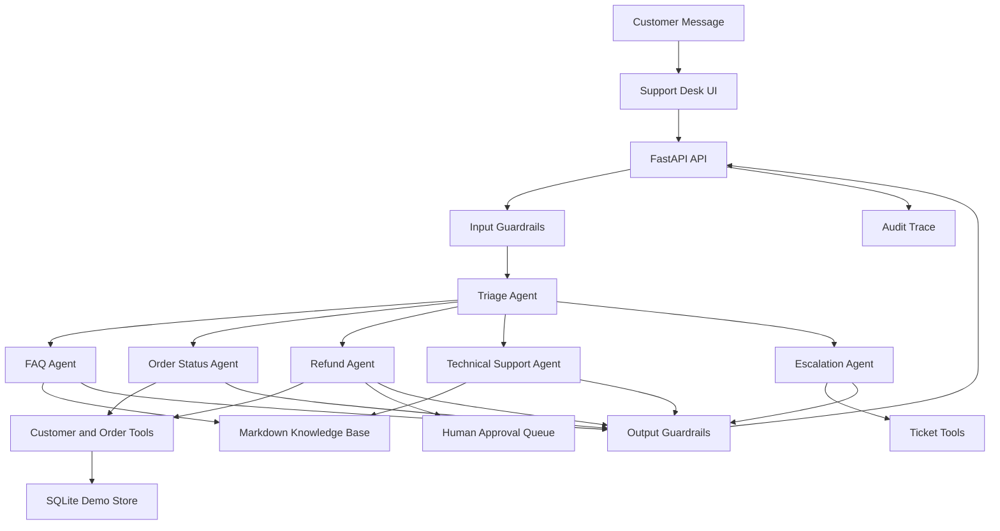

# Architecture

Customer Support Agent Desk is a deterministic local MVP of a production-style AI support workflow. The backend is FastAPI, the agent layer is organized as specialist modules, and all tool boundaries use Pydantic schemas.

## Components

- `app/api/`: FastAPI routes for chat, orders, admin reset actions, tickets, approvals, traces, and evals.
- `app/agents/`: deterministic local agents for triage, FAQ, orders, refunds, technical issues, escalation, and quality review.
- `app/tools/`: typed tool functions for customers, orders, tickets, refunds, and knowledge-base search.
- `app/guardrails/`: input, tool, and output guardrails.
- `app/services/`: orchestration, RAG search, approval decisions, and audit logs.
- `app/db/`: SQLite-backed demo store seeded from JSON customers and orders.
- `data/`: seed data, policy Markdown, and labeled eval cases.
- `frontend/`: static support desk UI served by FastAPI.

## Runtime Model

The MVP intentionally avoids requiring an OpenAI key for the portfolio demo. It uses deterministic local routing and lexical retrieval so tests and evals are repeatable. `.env.example` keeps the project ready for a future OpenAI Agents SDK adapter.

The local SQLite database is created from `DATABASE_URL` and stores customers, seed orders, custom orders, tickets, approvals, refund markers, and audit traces. Database Admin can clear workflow data while keeping orders, or restore the exact JSON seed customers and orders and delete custom orders.
